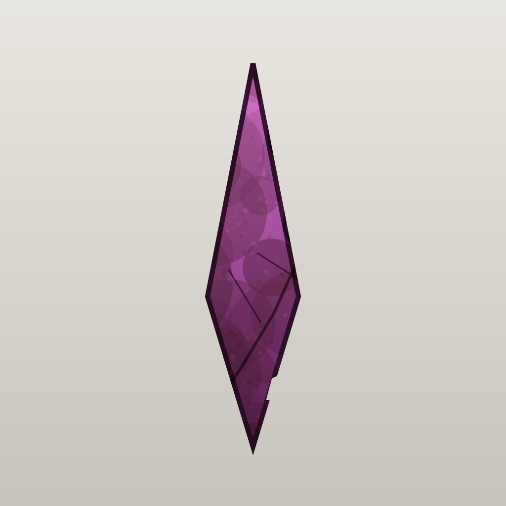
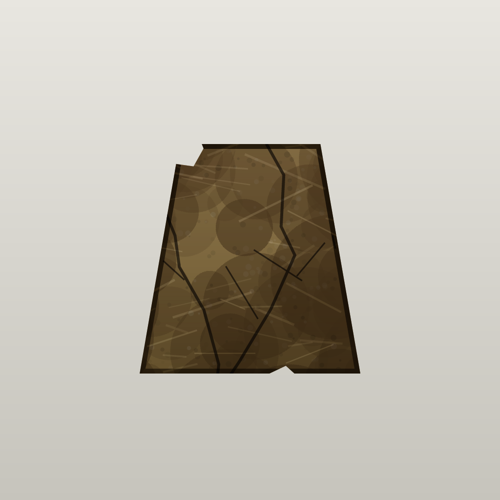
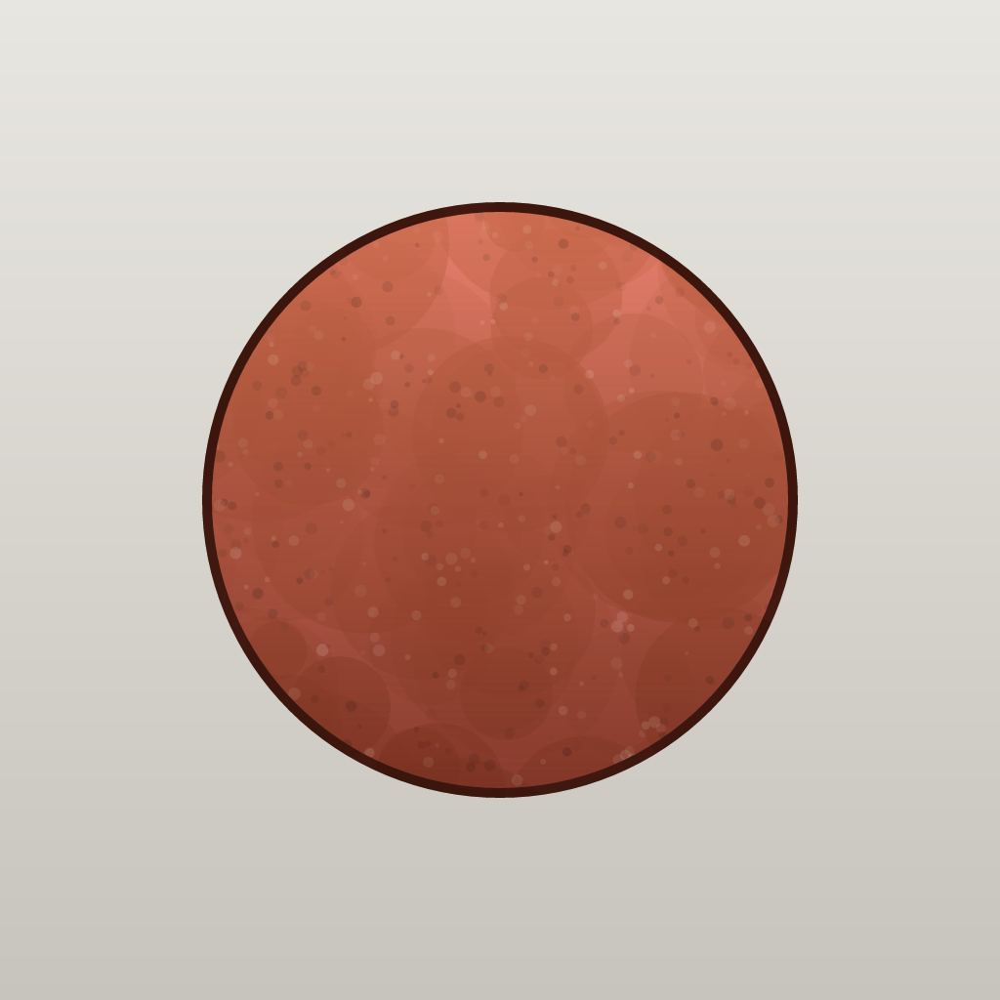

# QrArtifactChronicle 🏺

**Scan any QR code. Discover a unique artifact from a lost civilization. Same QR → same artifact, always.**

Turn the QR codes you meet every day into relics of imaginary ancient civilizations — then
collect them into your own museum.

<p align="center">
  
  
  
</p>

> ⚠️ **Prototype (v0.2.0).** The deterministic engine is solid and fully tested, and the **real
> 6-layer compositor is implemented** (shaded base + dirt, wear, cracks, chips, a preservation
> color-grade, and per-style backgrounds). The artwork itself is still **procedurally generated,
> stylized — not photographic**; the "museum / dig-site / catalog" photo look described below is the
> **end goal**. Treat the images above as real engine output, not final art.

**[English](#english) · [日本語](#日本語)**

---

# English

## What is this?

Point your camera at *any* QR code — a poster, a business card, a drink can — and the app
"excavates" a fictional artifact: its civilization, era, category, colour, dirt, damage, and a
tongue-in-cheek encyclopaedia entry are all derived **deterministically** from the QR's contents.
The same code always yields the exact same artifact, anywhere, forever.

### This is *not* a barcode-battler

No monsters, no battles, no stats to grind. QrArtifactChronicle is its own genre:

> **Archaeology × photography × a collection album.** A deterministic *artifact* generator — your
> everyday QR codes become an excavation site, and your collection becomes a museum.

## Core features

- 🎲 **Deterministic** — same QR → same artifact, always. No randomness, no timestamps.
- 📴 **Fully offline** — no server, no LLM at runtime. Everything is precomputed/bundled.
- 🖼️ **Generated artifact imagery** — each piece is composed on the fly (shape, colour, dirt,
  damage, preservation), so no two feel the same.
- 🏺 **Dirt · cracks · preservation, composited live** — wear and grime are layered at render time.
- 📜 **Invented civilizations & eras** with a deliberately pompous, dubious encyclopaedia blurb.
- 🏛️ **Exhibition room** — auto-saved collection with search and category / rarity / favorites filters.
- ❤️ **Favorites** — mark any artifact with ♥ (from a card or its detail view) and filter to just those.
- 🌐 **Bilingual (English / 日本語)** — switch instantly in Settings ⚙️; even the flavour text.
- ✨ **Gentle, gacha-style rarity** (★1 ≈ 40% … ★10 ≈ 0.01%); mythic ★11–13 only from genuinely
  old, dated QR codes.

## Why "photographs"? (the vision)

The goal is for every artifact to look like a **museum-grade photograph** — the same relic shown
as a glass-case *museum* exhibit, a muddy *dig-site* find, and a clean *catalogue* plate. Dirt,
cracks and preservation are applied on the fly so each piece feels like a real object pulled from
the ground. *(The 6-layer compositor is implemented; today's art is procedurally generated and
stylized, with swap-in photographic art on the roadmap — see [docs/05](docs/05-image-pipeline.md).)*

## Your daily life becomes a dig site

Every QR code you run into is a potential find. Collect them, fill your **Exhibition**, and build
a personal archaeological archive of a world that never existed.

## How to play

1. Tap **📷 Excavate with camera** (debug builds also allow typing any text, or **Random**).
2. Point at any QR code — it reads **automatically** (no shutter; scanned links are never opened).
3. Watch the retro dig animation:
   - **New find** → a girl digs it up → *"New discovery!"* → the artifact is revealed & saved.
   - **Already owned** → your stern master scolds you (*"no two artifacts are alike — you can't
     take it from the exhibition!"*).
4. Open the **🏛 Exhibition** to browse, search and filter by category / rarity / favorites.
5. Tap a card for the **detail page** (image, stats, and the encyclopaedia entry) — or tap ♥ to favorite it.

> **Camera tip (macOS).** The MacBook built-in camera is fixed-focus and struggles with QR codes.
> Use your **iPhone as a Continuity Camera** (autofocus reads them easily): keep it nearby (same
> Apple ID, Wi-Fi + Bluetooth on), still & locked, then pick it from the camera menu (*Re-scan
> cameras* if needed). An external webcam also works.

---

## How it works (for developers)

```
QR bytes → normalize → SHA-256 (seed) → tagged sub-streams → attributes
                                                  ├ rarity (integer thresholds, float-free)
                                                  ├ civilization / era / category
                                                  ├ colour (HSV), dirt, damage, preservation
                                                  └ era bonus (only if the QR embeds a real date)
        → DB select (civ × era × category × rarity, 6-stage fallback)
        → compose image (base sprite → HSV → dirt → damage → preservation → background)
        → flavour text (bilingual)
```

Byte-for-byte reproducible. A TypeScript reference implementation is the language-neutral
**oracle**; the Rust core reproduces its golden vectors exactly:

```
TS reference  ≡  reference/vectors/golden.json  ≡  Rust qrac-core  ≡  Swift (via UniFFI)
```

Design details live in **[docs/](docs/)** (00–08).

### Repository layout

```
docs/                 Design spec (00–08) + open-questions log
reference/            TypeScript reference core (oracle) + golden vectors + tests
rust/
  qrac-core/          Pure deterministic core (hash, normalize, rarity, timestamp,
                      appearance, flavor[bilingual], derive) — verified vs golden.json
  qrac-render/        I/O: SQLite base-artifact DB (rusqlite) + image compose (tiny-skia)
  qrac-ffi/           UniFFI boundary exposing the core to Swift/Kotlin
  qrac-assetgen/      Asset generator: base images + full-coverage DB + CI coverage gate
apple/                SwiftUI app (macOS; iOS-portable via Platform.swift) + multi-platform
                      XCFramework packaging (build-app.sh / build-xcframework.sh)
```

### Build & run

```bash
cd rust && cargo test --workspace                 # Rust core tests
cd reference && npm test                           # TypeScript oracle (Node ≥ 23.6)
cd rust && cargo run -p qrac-assetgen -- dist      # generate assets (+ coverage gate)
cd apple && bash build-app.sh                      # debug app  → QrArtifactChronicle.app
APP_CONFIG=release bash build-app.sh               # release app → QrArtifactChronicleRelease.app
open apple/QrArtifactChronicle.app                 # unsigned: first launch may need right-click → Open
cd apple && bash build-xcframework.sh              # multi-platform XCFramework (macOS + iOS device + sim)
```

Requirements: Rust (stable), Node ≥ 23.6, Xcode / Swift 6. iOS cross-builds need `rustup` with the
`aarch64-apple-ios` / `aarch64-apple-ios-sim` targets (see [docs/08 §8.13](docs/08-implementation-design.md)).

### Roadmap

- [x] In-app localization (English / 日本語), flavour text included.
- [x] Real 6-layer compositing (dirt/damage PNG layers + blend modes + subject mask).
- [ ] Photo-realistic artwork (real museum / dig-site / catalogue rendering; replace procedural art).
- [x] 1024² rendering + in-memory LRU cache for regenerated detail images.
- [x] Lightweight collection — store thumbnails, regenerate full-res detail on demand.
- [x] Extraction regression corpus locking TS≡Rust year detection.
- [~] iOS foundation — Rust cross-builds for device + simulator, multi-platform XCFramework, and
      AppKit→UIKit-portable Swift. Remaining: an Xcode iOS app target + code signing (see docs/08 §8.13).
- [ ] Android target (Kotlin bindings via cargo-ndk; Compose UI) + store signing / notarization.
- [ ] Replace UniFFI (MPL-2.0) with a hand-written C ABI for a fully permissive tree (only needed
      for a strict closed-source posture; MPL is fine for this MIT/OSS release).

## Why this project exists

An experiment in re-reading the most mundane digital objects — QR codes — as **archaeological
relics of imaginary civilizations**. Deterministic generation makes each code a fixed point in a
fictional history: the same scan always unearths the same lost artifact.

## License

**MIT © 2026 suzuki-black** — see [LICENSE](LICENSE).
Third-party components (all MIT-compatible; UniFFI is MPL-2.0, used unmodified) are listed in
[THIRD_PARTY_NOTICES.md](THIRD_PARTY_NOTICES.md). The flavour text is an homage to the *Minmei
Shobō* gag from the manga *Sakigake!! Otokojuku*; the publisher name and all blurbs are original.

---

# 日本語

**QRコードを読み取るだけで、架空文明の“唯一の遺物”が発掘される。同じQRなら、必ず同じ遺物。**

日常で出会うQRコードを、架空の古代文明の遺物に変えて、自分だけの博物館に収集できます。

> ⚠️ **プロトタイプ (v0.2.0)。** 決定論エンジンは完成・テスト済みで、**6層合成（陰影つきベース＋
> 汚れ・摩耗・ひび・欠け・保存状態グレード＋スタイル別背景）も実装済み**です。ただし現状のアートは
> **写真ではなく手続き生成のスタイライズ**であり、下記の「写真風（博物館／発掘現場／図録）」は
> **最終目標**です。上の画像は実エンジン出力（最終アートではない）です。

## これは何？

ポスター・名刺・缶ジュース…どんなQRコードにカメラを向けても、架空の遺物を「発掘」します。
文明・時代・カテゴリ・色・汚れ・破損、そして胡散臭い解説文まで、すべてQRの内容から**決定論的**
に決まります。同じコードからは、いつでもどこでも必ず同じ遺物が出ます。

### これは“バーコードバトラー”ではありません

モンスター生成もバトルも育成もありません。**考古学 × 写真 × 図鑑** という独自ジャンルの、
決定論的な**遺物**ジェネレータです。日常のQRが発掘現場に、コレクションが博物館になります。

## コア機能

- 🎲 **決定論** — 同じQR→必ず同じ遺物（乱数なし・時刻に依存しない）
- 📴 **完全オフライン** — 実行時にサーバもLLMも使わない（事前生成・同梱）
- 🖼️ **遺物画像をその場生成**（形・色・汚れ・破損・保存状態）— 二つと同じに感じない
- 🏺 **汚れ・ひび・保存状態をリアルタイム合成**
- 📜 **架空文明・架空時代**＋もったいぶった胡散臭い解説文
- 🏛️ **展示室** — 自動保存、文字検索＋カテゴリ／レア度／お気に入りフィルタ
- ❤️ **お気に入り** — 遺物に♥を付けて（カード／詳細画面から）、お気に入りだけに絞り込み
- 🌐 **英日二言語** — 設定⚙️で即時切替（解説文も）
- ✨ **優しいガチャ的レア度**（★1≈40%…★10≈0.01%）／神話級★11〜13は“現実に古い日付のQR”限定

## なぜ「写真風」か（ビジョン）

目標は、各遺物を**博物館級の写真**として見せること——同じ遺物を、ガラスケースの「博物館」、
泥のついた「発掘現場」、清潔な「図録」の3スタイルで。汚れ・ひび・保存状態をその場で重ね、
本当に地中から出土した実物のように感じさせます。*（6層合成エンジンは実装済み。現状のアートは
手続き生成のスタイライズで、写真アートへの差し替えがロードマップ：[docs/05](docs/05-image-pipeline.md)）*

## 日常が発掘現場になる

出会うQRすべてが発掘候補。集めて**展示室**を埋め、存在しなかった世界の考古アーカイブを作りましょう。

## 遊び方

1. **📷 カメラで発掘**（デバッグ版では手入力や**ランダム**も可）
2. QRにカメラを向けると**自動で読み取り**（シャッター不要・リンク自動表示なし）
3. ファミコン風の発掘演出:
   - **新規** → 女の子が掘り当て → 「しんはっけん！」→ 表示＆保存
   - **発掘済み** → お師匠様に叱られる（「同じ遺物は2つとない＝展示室から持ち出しちゃダメ！」）
4. **🏛 展示室**で閲覧・検索・フィルタ（カテゴリ／レア度／お気に入り）
5. カードをタップで**詳細**（画像・ステータス・解説文）／♥でお気に入り登録

> **カメラのコツ（macOS）**: 内蔵カメラは固定焦点でQRが苦手。**iPhoneを連係カメラ**にすると快適
> （近接・静止・ロック → カメラメニューで選択、出なければ「カメラを再検索」）。外付けカメラも可。

## 仕組み（開発者向け）

詳細は **[docs/](docs/)**（00〜08）。`QRバイト→正規化→SHA-256→属性→DB選択(6段)→画像合成→解説文`
の全工程がバイト単位で再現可能。TypeScript参照実装をオラクルとし、Rustコアがゴールデンベクタを
完全一致で再現します（`TS ≡ golden.json ≡ Rust ≡ Swift`）。ビルドは英語セクションの Build & run 参照。

## ライセンス

**MIT © 2026 suzuki-black**（[LICENSE](LICENSE)）。サードパーティは [THIRD_PARTY_NOTICES.md](THIRD_PARTY_NOTICES.md)
（すべてMIT互換、UniFFIはMPL-2.0で未改変）。解説文は『魁!!男塾』民明書房ネタへのオマージュ（出版社名・本文はオリジナル）。
